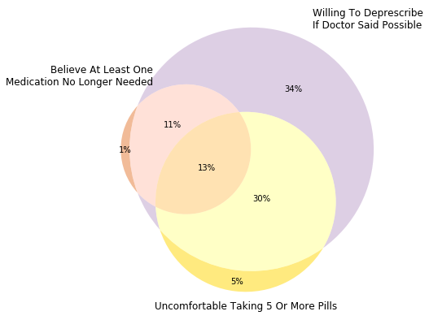

# Stata Tabulations
```{r, echo=FALSE, warning=FALSE, message=FALSE}
library(readr)
library(dplyr)
library(VennDiagram)
```

The Stata code below outputs the subsequent table. It represents the distribution $P(A3, A4 | PM=0)$.

```
tabout binaryattitude3 binaryattitude4 if subpop & pillsmax==0 using "../tables/plottables/binaryattitude3-binaryattitude4-pillsmax0.csv", svy cells(cell) format(4) replace
```

```{r, echo=FALSE, warning=FALSE, message=FALSE}
pm_0 <- read_delim('../tables/plottables/binaryattitude3-binaryattitude4-pillsmax0.csv')
pm_0 %>% knitr::kable()
```

The next table represents $P(A3, A4 | PM=1)$.

```
tabout binaryattitude3 binaryattitude4 if subpop & pillsmax==1 using "../tables/plottables/binaryattitude3-binaryattitude4-pillsmax1.csv", svy cells(cell) format(4) replace
```


```{r, echo=FALSE, warning=FALSE, message=FALSE}
pm_1 <- read_delim('../tables/plottables/binaryattitude3-binaryattitude4-pillsmax1.csv')
pm_1 %>% knitr::kable()
```


The survey-weighted probabilities for $P(PM=1)$ and $P(PM=0)$ are calculated using the following Stata code.

```
tabout pillsmax if subpop using "../tables/plottables/pillsmax.csv", svy cells(cell) format(4) replace
```

```{r, echo=FALSE, warning=FALSE, message=FALSE}
pm_dist <- read_delim('../tables/plottables/pillsmax.csv')
pm_dist %>% knitr::kable()
```

# Venn Diagram Calculations
Our aim is to derive the probability mass distribution of $A3, A4,$ and $PM$. Since these are binary variables, a 3x3 with percentage values as a column will do. We will use the survey-weighted Stata tables from above to derive the Venn diagram percentages because we cannot do survey-weighted 3-way tables in Stata.

The following value represents the survey-weighted $P(PM=0)$.
```{r}
disagree_prop <- as.numeric(pm_dist[1,'Prop.'])
disagree_prop
```

Then, we could calculate $P(A3,A4|PM=0) \cdot P(PM=0)$.

```{r, echo=FALSE}
pm_0_calculation <- pm_0[3:5, 2:4]
pm_0_calculation[,1] <- disagree_prop * as.numeric(unlist(pm_0_calculation[,1])) * 100
pm_0_calculation[,2] <- disagree_prop * as.numeric(unlist(pm_0_calculation[,2])) * 100
pm_0_calculation[,3] <- disagree_prop * as.numeric(unlist(pm_0_calculation[,3])) * 100
pm_0_calculation <- cbind(c('disagree', 'agree', 'total'), pm_0_calculation)
names(pm_0_calculation) <- c('','disagree', 'agree', 'total')
pm_0_calculation %>% knitr::kable()
```


The following value represents the survey-weighted $P(PM=1)$.
```{r}
agree_prop <- as.numeric(pm_dist[2,'Prop.'])
agree_prop
```

Then, we could calculate $P(A3,A4|PM=1) \cdot P(PM=1)$.

```{r, echo=FALSE}
pm_1_calculation <- pm_1[3:5, 2:4]
pm_1_calculation[,1] <- agree_prop * as.numeric(unlist(pm_1_calculation[,1])) * 100
pm_1_calculation[,2] <- agree_prop * as.numeric(unlist(pm_1_calculation[,2])) * 100
pm_1_calculation[,3] <- agree_prop * as.numeric(unlist(pm_1_calculation[,3])) * 100
pm_1_calculation <- cbind(c('disagree', 'agree', 'total'), pm_1_calculation)
names(pm_1_calculation) <- c('','disagree', 'agree', 'total')
pm_1_calculation %>% knitr::kable()
```

We can collapse these dataframes. I am melting the 2x2 contingency table for $PM=0$, adding a column that indicates $PM=0$ for these frequencies, then changing the values from attitudinal values from Agree/Disagree to 0/1. 

```{r}
a <- pm_0_calculation[1:2, 1:3]
names(a)[1] <- 'placeholder'
a2 <- a %>%
  reshape2::melt(id.vars='placeholder') %>%
  mutate(pillsmax=0) %>%
  rename(binaryattitude3=placeholder) %>%
  rename(binaryattitude4=variable) %>%
  mutate(binaryattitude3=ifelse(binaryattitude3=='agree', 1, 0)) %>%
  mutate(binaryattitude4=ifelse(binaryattitude4=='agree', 1, 0)) %>%
  select(binaryattitude3, binaryattitude4, pillsmax, value)
```
```{r, echo=FALSE}
a2 %>% knitr::kable()
```

After repeating the same calculation with the $PM=1$ table, we can construct a 3-way survey-weighted table by binding the rows together. Recall that `value` is the overall percentage.

```{r, echo=FALSE, include=FALSE}
b <- pm_1_calculation[1:2, 1:3]
names(b)[1] <- 'placeholder'
b2 <- b %>%
  reshape2::melt(id.vars='placeholder') %>%
  mutate(pillsmax=1) %>%
  rename(binaryattitude3=placeholder) %>%
  rename(binaryattitude4=variable) %>%
  mutate(binaryattitude3=ifelse(binaryattitude3=='agree', 1, 0)) %>%
  mutate(binaryattitude4=ifelse(binaryattitude4=='agree', 1, 0)) %>%
  select(binaryattitude3, binaryattitude4, pillsmax, value)
b2
```

```{r, echo=FALSE}
percent_grid <- bind_rows(a2, b2)  %>% arrange(-binaryattitude3, -binaryattitude4, -pillsmax)
percent_grid$value <- percent_grid$value %>% round(4)

write_csv(percent_grid, '../tables/clean-csv/venn-percentages.csv')

percent_grid %>% knitr::kable()
```

Notice that if we sum up the `value` column, we get a total of `r sum(percent_grid$value)` which is slightly above 100%. This is due to rounding error.

# Plotting Venn Diagaam

Recall our current Venn diagram looked like this.

```{r}

```

We will recreate in R. It will not be to scale, but it is based off of the calculations above. The Venn diagram above can be used for comparisons.

```{r}
k <- 1
p <- draw.triple.venn(area1=percent_grid %>%
                        filter(binaryattitude3==1) %>%
                        pull(value) %>%
                        sum() %>%
                        round(digits=k),
                      
                      area2=percent_grid %>%
                        filter(binaryattitude4==1) %>%
                        pull(value) %>%
                        sum() %>%
                        round(digits=k),
                      
                      area3=percent_grid %>%
                        filter(pillsmax==1) %>%
                        pull(value) %>%
                        sum() %>%
                        round(digits=k),
                      
                      n12=percent_grid %>%
                        filter(binaryattitude3==1 & binaryattitude4==1) %>%
                        pull(value) %>%
                        sum() %>%
                        round(digits=k),
                      
                      n23=percent_grid %>% 
                        filter(binaryattitude4==1 & pillsmax==1) %>%
                        pull(value) %>%
                        sum() %>%
                        round(digits=k),
                      
                      n13=percent_grid %>% 
                        filter(binaryattitude3==1 & pillsmax==1) %>%
                        pull(value) %>%
                        sum() %>%
                        round(digits=k),
                      
                      n123=percent_grid %>% 
                        filter(binaryattitude3==1 & binaryattitude4==1 & pillsmax==1) %>%
                        pull(value) %>%
                        sum() %>%
                        round(digits=k),
                      
                     category=c('Believe At Least One\nMedication No Longer Needed',
                                'Willing To Deprescribe\nIf Doctor Said Possible',
                                'Uncomfortable Taking 5 Or More Pills'),
                     fill=c('#E47833', '#BDA0CB', 'gold'))
grid.draw(p)
```

```{r}

p <- draw.triple.venn(area1=25,
                      
                      area2=88,
                      
                      area3=49,
                      
                      n12=24,
                      
                      n23=43,
                      
                      n13=14,
                      
                      n123=13,
                      
                     category=c('Believe At Least One\nMedication No Longer Needed',
                                'Willing To Deprescribe\nIf Doctor Said Possible',
                                'Uncomfortable Taking 5 Or More Pills'),
                     fill=c('#E47833', '#BDA0CB', 'gold'))
grid.draw(p)
```

```{r}
library(eulerr)
k<-0

VennDiag <- euler(c("A" = percent_grid %>%
                        filter(binaryattitude3==1) %>%
                        pull(value) %>%
                        sum() %>%
                        round(digits=k),
                    
                    "B" = percent_grid %>%
                        filter(binaryattitude4==1) %>%
                        pull(value) %>%
                        sum() %>%
                        round(digits=k),
                    
                    "C" = percent_grid %>%
                        filter(pillsmax==1) %>%
                        pull(value) %>%
                        sum() %>%
                        round(digits=k),
                    
                    "A&B" = percent_grid %>%
                        filter(binaryattitude3==1 & binaryattitude4==1) %>%
                        pull(value) %>%
                        sum() %>%
                        round(digits=k),
                    
                    "B&C" = percent_grid %>% 
                        filter(binaryattitude4==1 & pillsmax==1) %>%
                        pull(value) %>%
                        sum() %>%
                        round(digits=k),
                    
                    "A&C" = percent_grid %>% 
                        filter(binaryattitude3==1 & pillsmax==1) %>%
                        pull(value) %>%
                        sum() %>%
                        round(digits=k),
                    
                    "A&B&C" = percent_grid %>% 
                        filter(binaryattitude3==1 & binaryattitude4==1 & pillsmax==1) %>%
                        pull(value) %>%
                        sum() %>%
                        round(digits=k)))

plot(VennDiag, quantities = TRUE, font=1, cex=1, alpha=0.5,
     fill=c('#E47833', '#BDA0CB', 'gold'))
```

```{r}
library(eulerr)
VennDiag <- euler(c("A" = 1, "B" = 34, "C" = 5, "A&B" = 11, "B&C" = 30,
                    "A&C" = 0.5, "A&B&C" = 13))
plot(VennDiag, quantities = TRUE, font=1, cex=1, alpha=0.5,
     fill=c('#E47833', '#BDA0CB', 'gold'))
```
